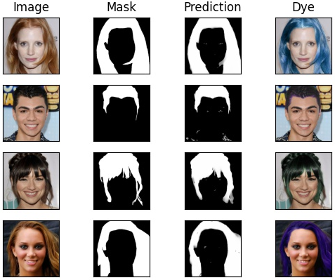

# Hair segmentation


The architecture was proposed by [Alex L. Cheng C, etc. 'Real-time deep hair matting on mobile devices'](https://arxiv.org/pdf/1712.07168.pdf). This repository is based on https://github.com/aobo-y/hair-dye.


## Data

Download dataset from https://github.com/switchablenorms/CelebAMask-HQ and split it in train/val/test folds using https://github.com/switchablenorms/CelebAMask-HQ/tree/master/face_parsing#preprocessing. You should get 23608 in train and 2931 in validation.


**Data structure training**
```
├── hair_seg/data/dataset_celeba
│   ├── train
│   │   ├──images
│   │   │   ├── 1.jpg
│   │   │   ├── 2.jpg
...
│   │   ├──masks
│   │   │   ├── 1.png
│   │   │   ├── 2.png
...
│   ├── val
...
```

## Train

```
$ CUDA_VISIBLE_DEVICES=0 python -u main.py --mode=train --model_name default --print_freq 5 --optimizer adam --lr 1e-3 --wup 2000 --ep 16 --lr_schedule cosine
```

The checkpoint and sample images are saved in `hair_seg/checkpoint/default/` by default.

### trained models
Checkpoints, logs and tensorboards you can download [here](https://drive.google.com/drive/folders/1xg4m50SLbKgQWEXUpVUn1Af2HtsR7faU?usp=sharing).

Trained model gives around 0.89 IoU.

## Inference

Plot a groundtruth image, the predicted segmentation and the hue adjusted result.
With specified image:
```
$ python main.py --mode=run --checkpoint train_16 --model_name default --image=./path/to/the/image.png
```

With train or test datasets images:
```
$ python main.py --mode=run --set=test --num=4 --checkpoint train_16 --model_name default
```

`set` can be one `train` and `test`, default is `test`

`num` is the random number of images from the set, default is `4`
